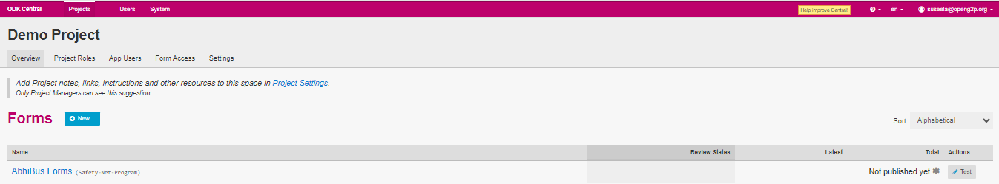
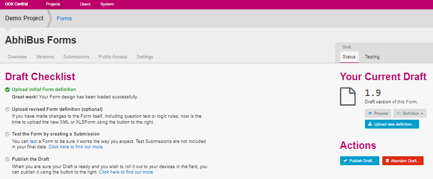
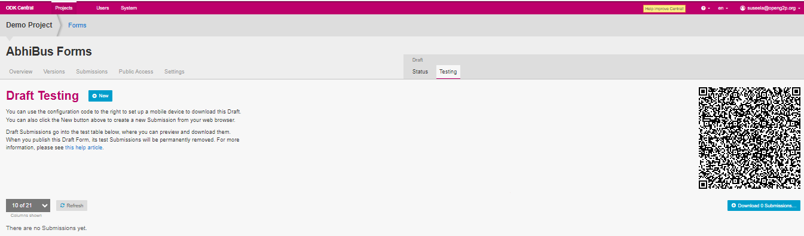

# Test a Form

## Description

This document provides instructions to test a form available in a project using ODK Central.

## Pre-requisites

* [ODK Central](https://docs.getodk.org/central-intro/) must be deployed and available
* A user must have valid credentials to login **ODK Central**
* A user must have an Administrator role in ODK Central. See [Create User and Assign Role](../../eligibility-and-program-enrollment/settings/assign-roles-to-users.md) guide
* A user must have ODK Collect App in his/her device

## Procedure

1. Login to the **ODK Central**
2. Click the relevant project link.

For example, here, the project is considered as Demo project&#x20;

3. Click the project (Demo) link listed below the **Projects**.

<figure><figcaption>
ODK home screen
</figcaption></figure>

4. The project (Demo) overview page is displayed.

<figure><figcaption>
Uploaded form
</figcaption></figure>

5. Click the form available below the _**Forms**_.

For example, here the form selected is AbhiBus Forms.

The  AbhiBus Forms screen is displayed.

<figure><figcaption>
Forms screen
</figcaption></figure>

6. Click the _**test**_ link available in the _**Draft Checklist**_ below the option _**Test the form by creating a Submission**_

The _**Draft Testing**_ screen is displayed.&#x20;

<figure><figcaption>
Draft Testing screen
</figcaption></figure>

7. Click _**+New**_ button to preview the uploaded form.&#x20;
8. Click the _**Testing**_ tab in the _**Draft**_ section.&#x20;
9. _**Testing**_ tab displays the QR code.
10. Tab the _**ODK Collect App**_ in his/her mobile.
11. Tap the _**Configure with QR code**_ button.

Add project screen is displayed.

12. Scan the _**QR code**_ of a relevant form in a project from the _**ODK Central**_.

The form is configured in the _**ODK Collect App**_.

<figure><figcaption></figcaption></figure>

This completes the testing of the uploaded form.
