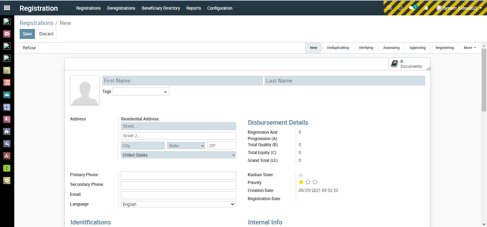
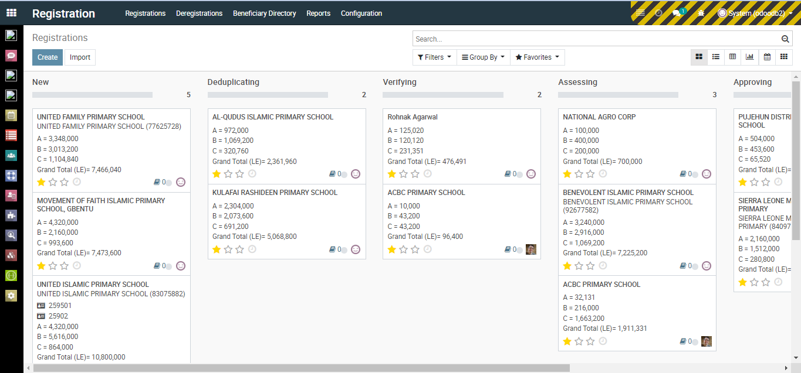
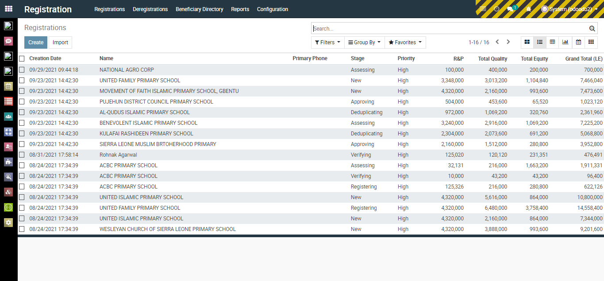
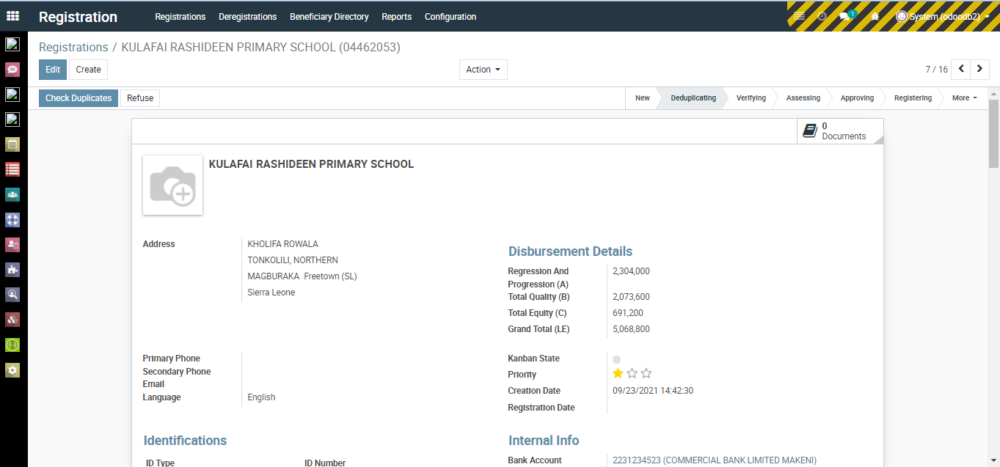
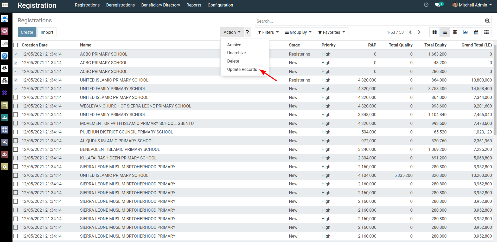
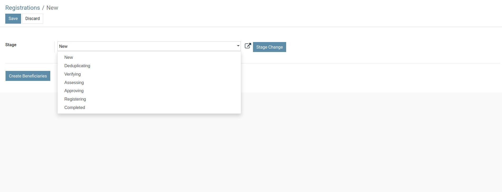

# Registration

<figure><figcaption></figcaption></figure>

<figure><figcaption></figcaption></figure>

<figure><figcaption></figcaption></figure>

<figure><figcaption></figcaption></figure>

## Checking duplicates

<figure><figcaption></figcaption></figure>

## Changing state in bulk

<figure><figcaption></figcaption></figure>

<figure><figcaption></figcaption></figure>
