# Tasks and Processes

## Tasks

### Task

<figure>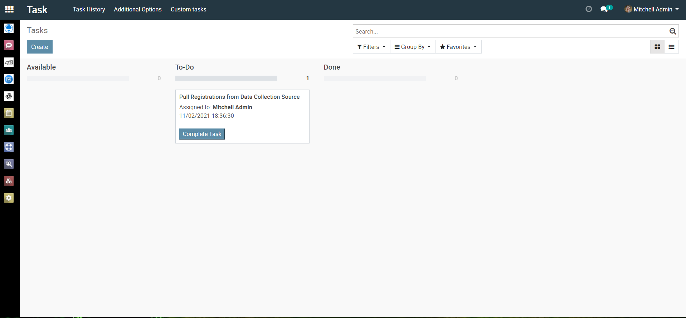<figcaption></figcaption></figure>

<figure>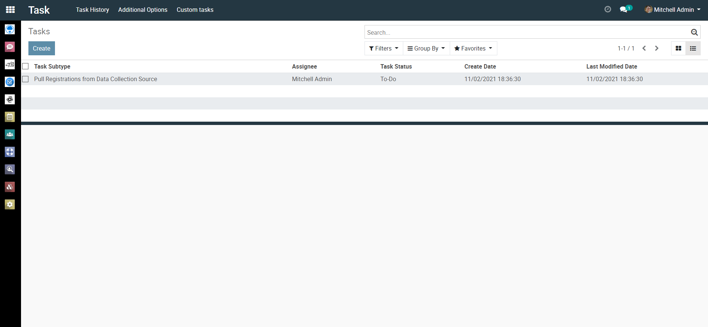<figcaption></figcaption></figure>

### Task history

<figure>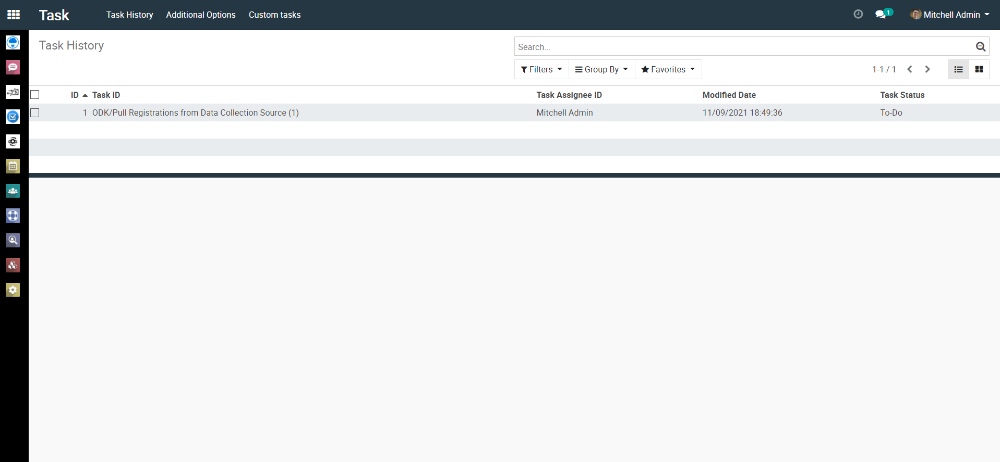<figcaption></figcaption></figure>

### Task type

<figure>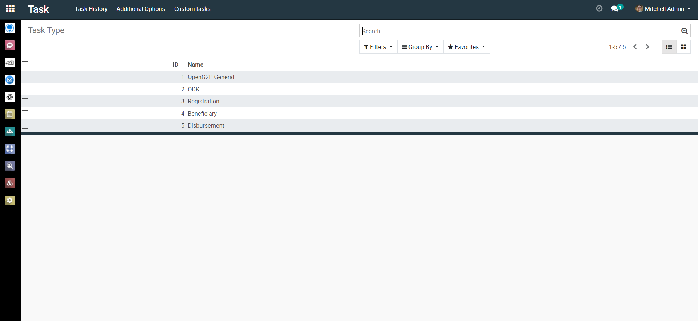<figcaption></figcaption></figure>

### Task role

<figure>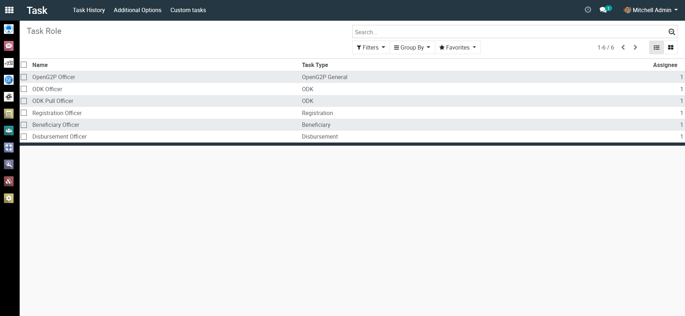<figcaption></figcaption></figure>

### Task subtype

<figure>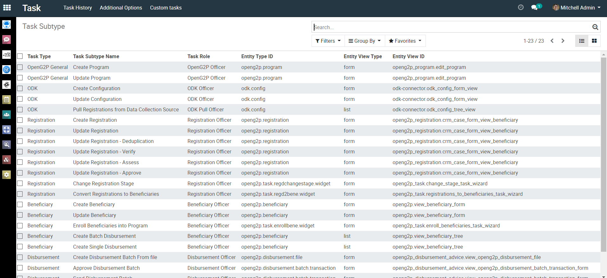<figcaption></figcaption></figure>

## Custom tasks

### Change state of registrations

<figure>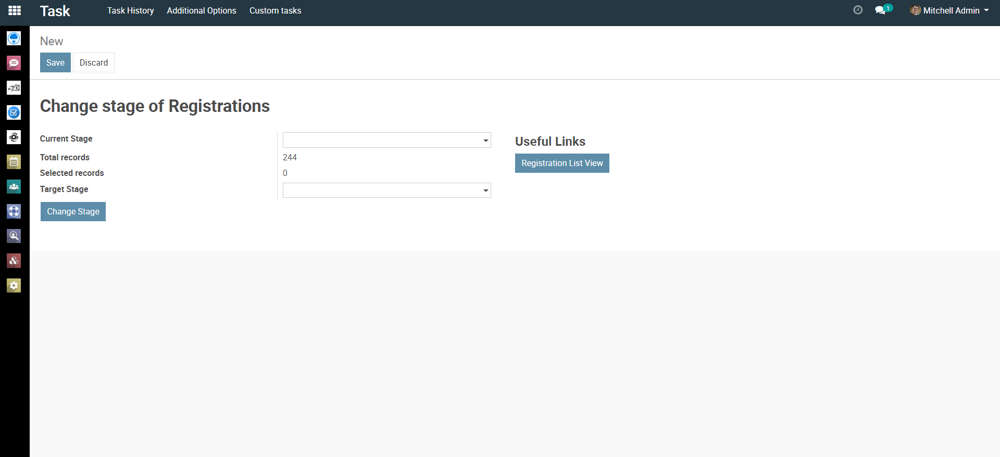<figcaption></figcaption></figure>

### Convert registrations to beneficiaries

<figure>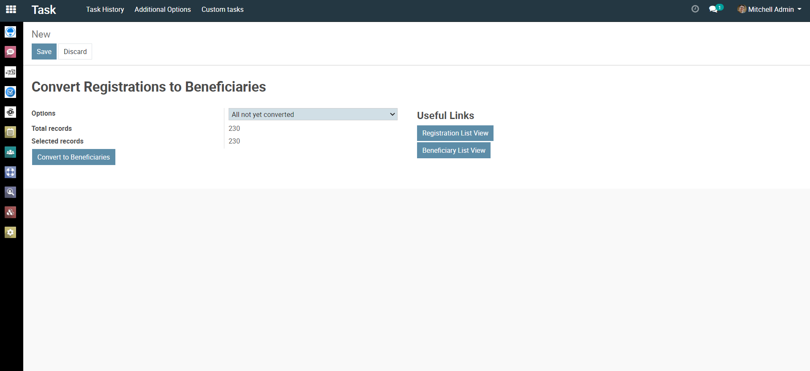<figcaption></figcaption></figure>

### Enrol beneficiaries into programs

<figure>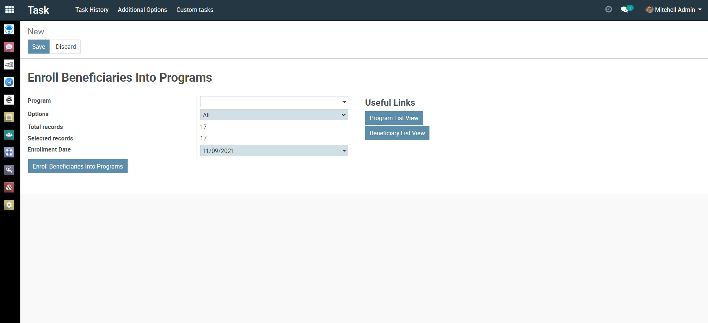<figcaption></figcaption></figure>

## Process

<figure>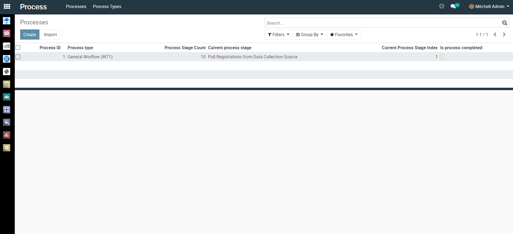<figcaption></figcaption></figure>

<figure>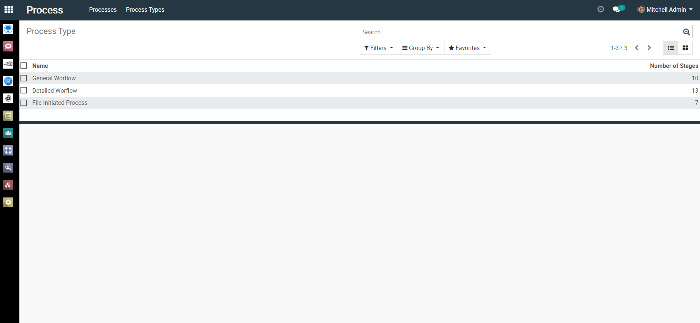<figcaption></figcaption></figure>

<figure>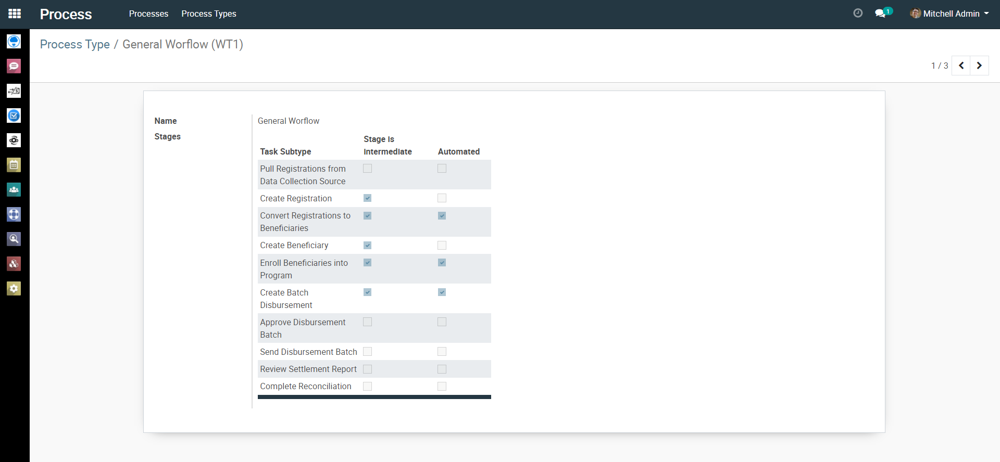<figcaption></figcaption></figure>
