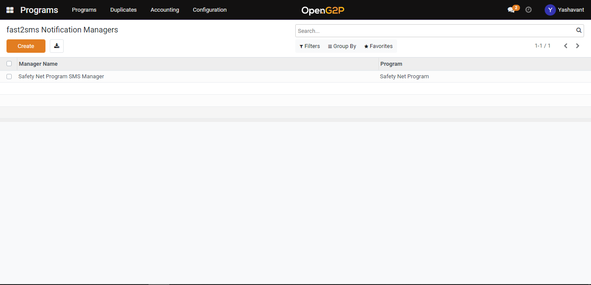
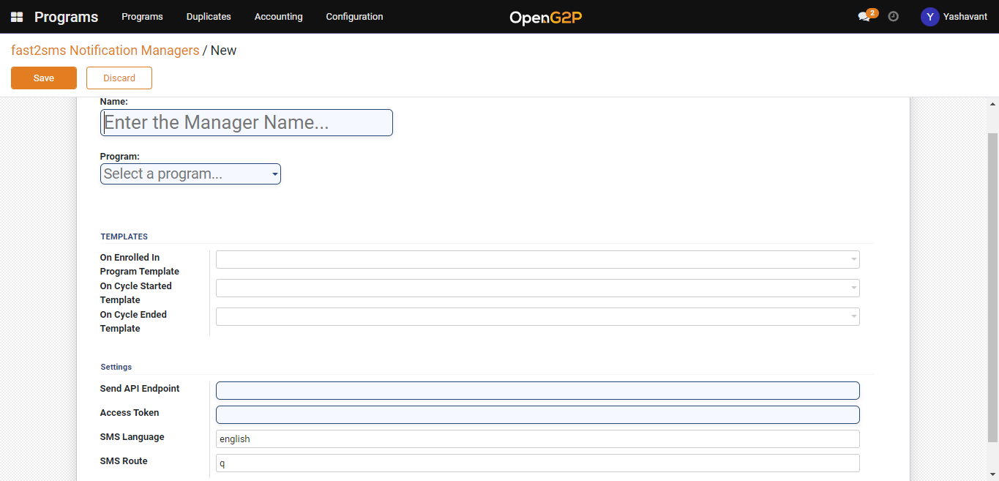

# Create Fast2SMS Notification Manager

## Description

This guide will provide the steps to create a Fast2SMS notification manager.

## Pre-requisites

## Steps

1. Navigate to _Programs_ using the menu bar.

<figure><figcaption></figcaption></figure>

2. Click on _Configuration_ and then on _Fast2SMS Notification Manager._

<figure><figcaption></figcaption></figure>

2. Click the _Create_ button to navigate to the Fast2SMS notification manager creation page.

<figure><figcaption></figcaption></figure>

3. Fast2SMS notification manager creation page

* _Name_: Provide a name for the manager
* _Program_: Select the program from the drop-down for which the manager is created
* _On Enrolled In Program Template_: Select the template from the drop-down for program enrolment notification.
* _On Cycle Started Template:_ Select the template from the drop-down for the program cycle started notification.
* _On Cycle Ended Template_: Select the template from the drop-down for the program cycle-ended notification.
* _Send API Endpoint_: Provide the service provider API endpoint.
* _Access Token_: Provide the access token of the service provider.

<figure><figcaption></figcaption></figure>

5. After clicking on the _Save_ button notification will be saved under the Fast2SMS notification manager list view page.
