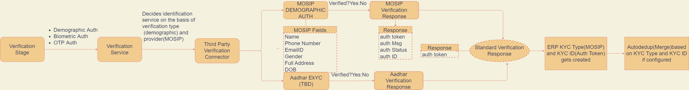

# Verification Service

## About

* Verification is a way  to verify people and make sure that they are who they claim to be.
* It helps to validate their official ID Document before getting benefits under different social protection programs
* It is done in 3 ways
* Demographic AUTH
* OTP AUTH
* &#x20;Biometric AUTH

## High level overview

<figure><figcaption></figcaption></figure>

## Verification guide

[https://www.notion.so/Verification-Service-62af2369634b4e4db02ac919d1849df2](https://www.notion.so/Verification-Service-62af2369634b4e4db02ac919d1849df2)
