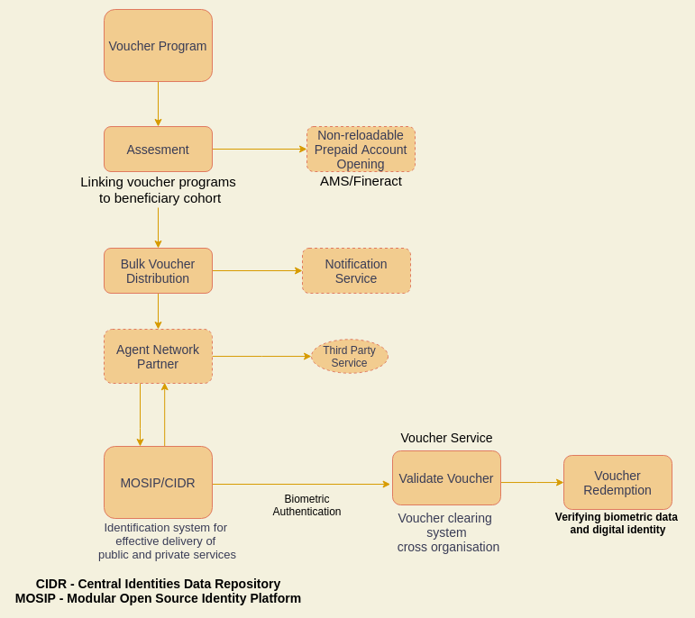

# Voucher Service

## About

* A voucher is equivalent to proof of cash value and is not redeemable for cash, the anti-counterfeiting of vouchers is a very important issue.
* Only eligible individuals can receive and use vouchers.
* The agent networks then ask the government or non-profit organizations for the goods and services with the voucher code.

## High level overview

<figure><figcaption></figcaption></figure>

## Verification guide

[https://www.notion.so/Voucher-Design-a03d69662c2d4c3da6a07948493d04f7](https://www.notion.so/Voucher-Design-a03d69662c2d4c3da6a07948493d04f7)
