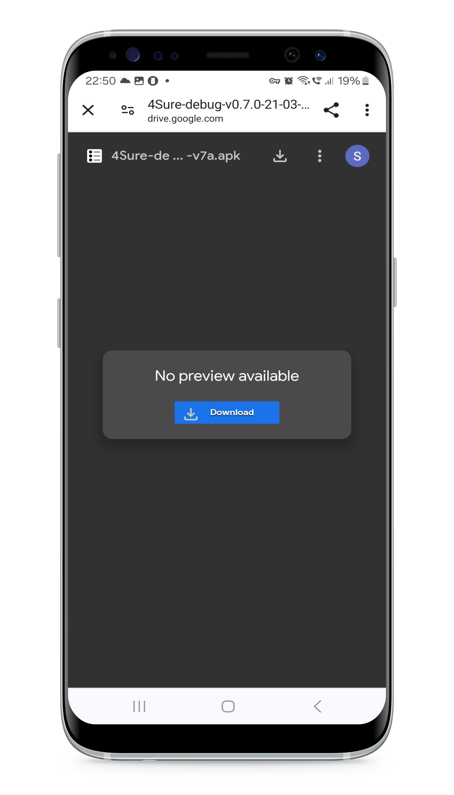
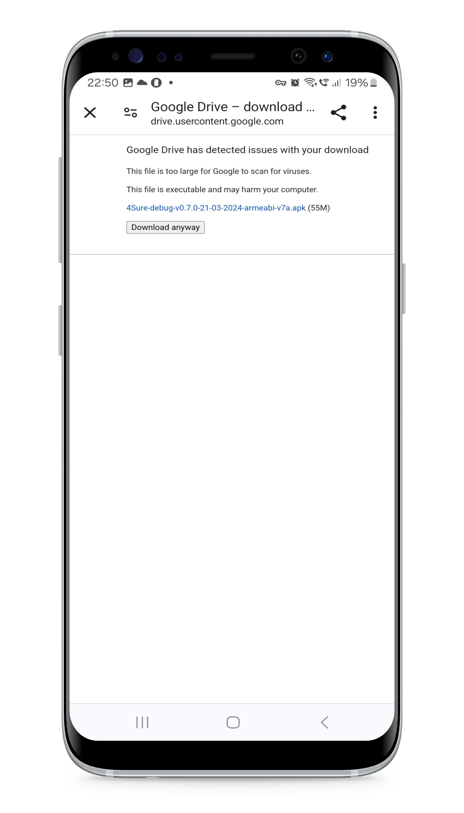
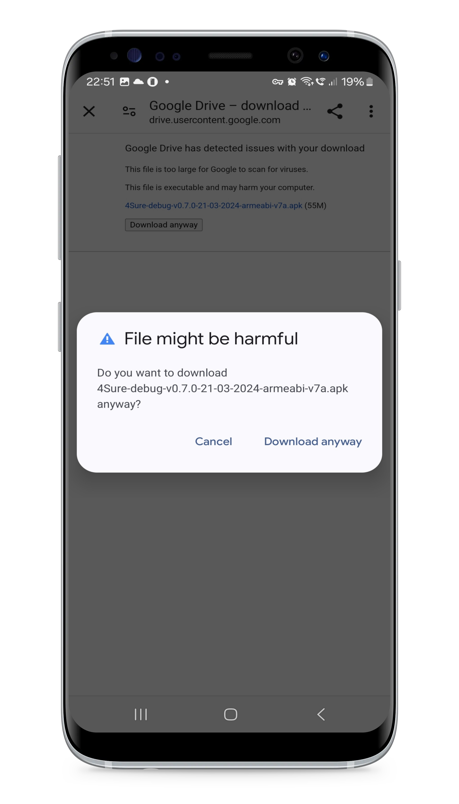
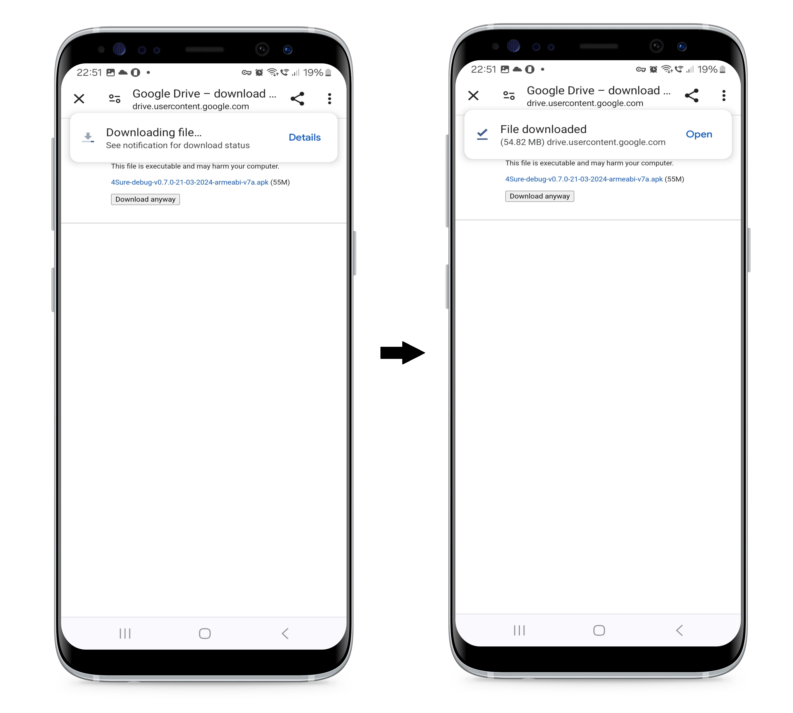
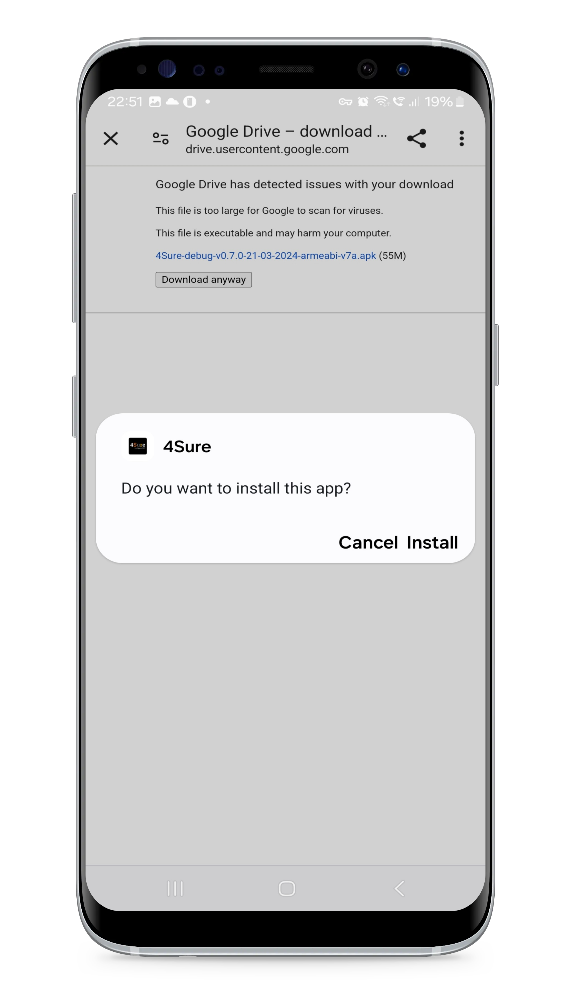
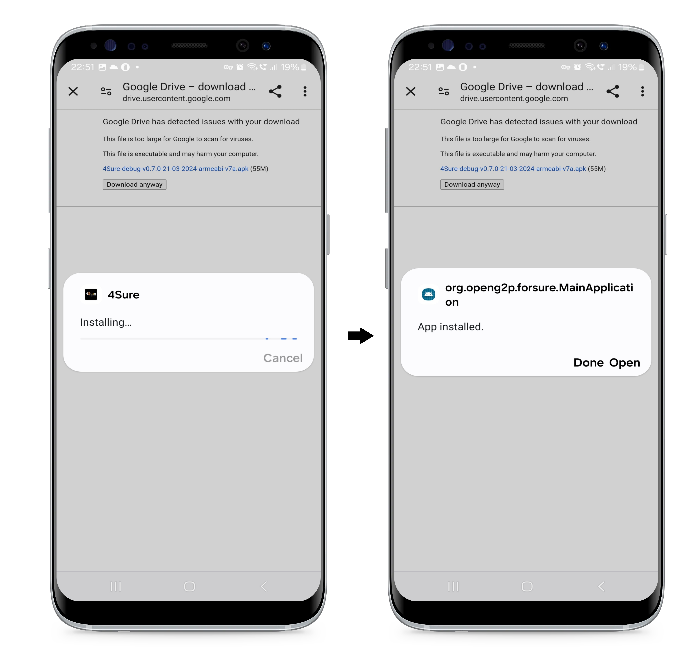
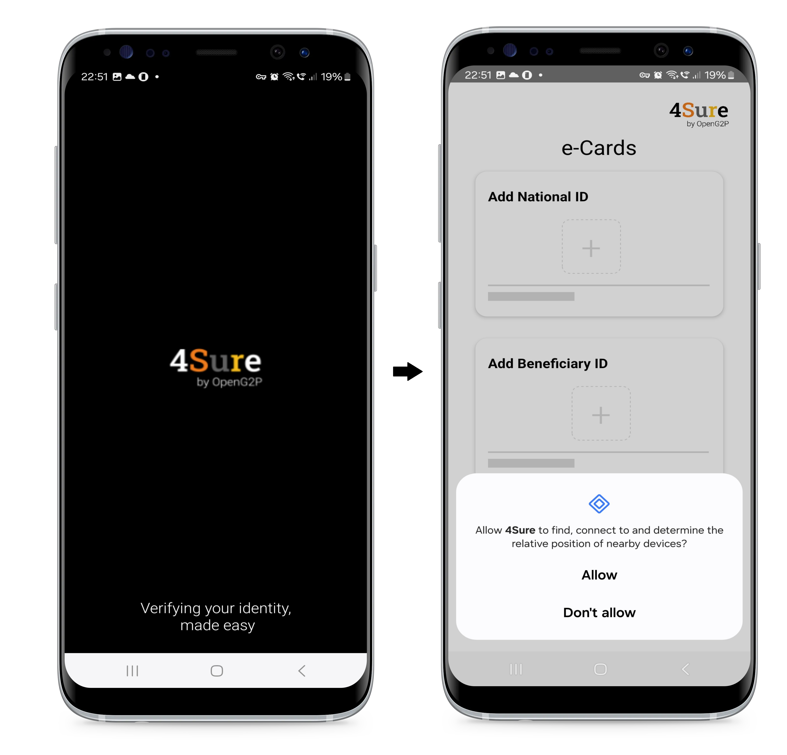

---
layout:
  title:
    visible: true
  description:
    visible: false
  tableOfContents:
    visible: true
  outline:
    visible: true
  pagination:
    visible: true
---

# Installation Guide for 4Sure Application

This document provides instructions to install the 4Sure application on an Android mobile

## Pre-requisites

A user must have a mobile device with 64-bit architecture or 32-bit arm device.

## Procedure

1. Click the link [https://drive.google.com/file/d/1GeQFXjSOC69iZx91rX0fu5HWstM3rS5B/view?usp=sharing](https://drive.google.com/file/d/1GeQFXjSOC69iZx91rX0fu5HWstM3rS5B/view?usp=sharing), to begin the installation of the 4Sure app on the android mobile with 64-bit architecture

(or)

Click the link [https://drive.google.com/file/d/1bY4h7UdNT5RCpskgjIHuW9YIBVwc1gSL/view?usp=sharing](https://drive.google.com/file/d/1bY4h7UdNT5RCpskgjIHuW9YIBVwc1gSL/view?usp=sharing), to begin the installation of the 4Sure app on the android mobile with 32-bit arm.

_**Note:**_&#x20;

Here, the below procedure is to install 4Sure application on an android mobile with 32-bit arm.

The 4Sure APK file which is compatible with the device with a 32-bit arm is displayed.

<figure><figcaption>
4Sure APK file
</figcaption></figure>

2. Click the _**Download**_ button.

An alert message is displayed.

<figure><figcaption>
A message from Google drive
</figcaption></figure>

3. Click the _**Download anyway**_ button.

<figure><figcaption>
File download dialog box
</figcaption></figure>

4. Read the caution message and click the _**Download anyway**_ button.

The file starts downloading and the message "File downloaded" pops up.

<figure><figcaption>
4Sure app downloaded
</figcaption></figure>

5. Click the _**Open**_ button to finish the file download.

A message pops up to install 4Sure app.

<figure><figcaption></figcaption></figure>

6. Click the _**Install**_ option.

The installation begins and the message "Apps installed"  pops up.

<figure><figcaption>
4Sure app installed
</figcaption></figure>

7. Click the _**Open**_ option to finish the 4Sure app installation.

<figure><figcaption>
4Sure application
</figcaption></figure>

8. Click the _**Allow**_ option to allow the 4Sure app to find, connect to and determine the relative position of nearby devices.

<figure><figcaption>
4Sure e-Cards screen
</figcaption></figure>

Now, you can use 4Sure app to begin the verification of the digital credentials of the beneficiaries.
