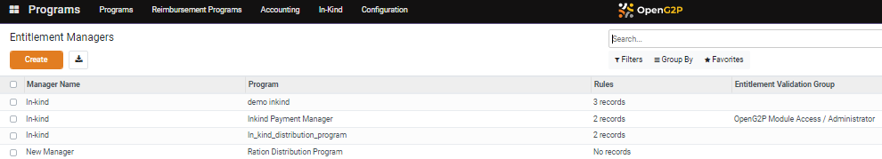
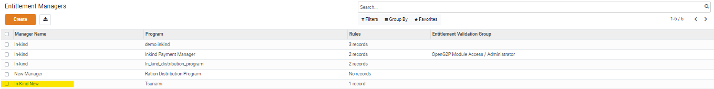

# Configure In-Kind Entitlement Manager

This document provides instructions to configure In-Kind Entitlement Manger under program.

## Prerequisites

* The user must have access to Program module in OpenG2P systems.
* The user must have the Program Manger role.

## Procedure

1. Click the main menu icon  and select _**Programs**_.

<figure><figcaption></figcaption></figure>

_**Programs**_ screen is displayed.

2. Click the _**Configuration**_ and then select _**In-Kind Entitlement Managers**_ in the menu bar.&#x20;

<figure><figcaption></figcaption></figure>

_**Entitlement Managers**_ screen is displayed.

<figure><figcaption></figcaption></figure>

3. Click the _**Create**_ button.

_**Entitlement Managers/New**_ screen is displayed.

<figure><figcaption></figcaption></figure>

The fields and their descriptions are given below:

| Field                              | Description                                       |
| ---------------------------------- | ------------------------------------------------- |
| Name                               | Enter the manager name                            |
| Program                            | Select the appropriate program from the drop-down |
| Manage stock movements (inventory) | Check the box, if applicable                      |
| Evaluate one item                  | Check the box, if applicable                      |

4. Click the _**items**_ tab.
5. Click the _**Add a line**_.

_**Create Entitlement Items**_ screen is displayed.

<figure><figcaption></figcaption></figure>

The fields and their descriptions are given below:

| Field             | Description                                                |
| ----------------- | ---------------------------------------------------------- |
| Product           | Enter the product name                                     |
| QTY               | Enter the number of quantity                               |
| Unit of  Measure  | Auto-populates the unit of measure                         |
| Condition Domain  | Use the condition domain filter to narrow down the search  |
| Multiplier        | Enter the number of multiplier for the quantity            |
| Maximum number    | Enter the maximum number of the quantity                   |
|  Save & Close     | Click the save & close button to save and exit the screen  |
| Save & New        | Click the save & new to save and to add a new product      |
| Discard           | Click the discard button to exit the screen                |

The above entered data gets auto-populated in the _**Entitlement/New Managers**_ screen.

<figure><figcaption></figcaption></figure>

Note:&#x20;

The values of the Product, QTY, Unit of Measure, Multiplier and Maximum are auto-populated as shown in the above image.

6. Enter the _**ID Type**_ to store in entitlements.
7. Enter the  **Entitlement Validation Group**.
8. Click the _**Save**_ button to save the data.
9. Click the _**Discard**_ button to exit the screen.

<figure><figcaption></figcaption></figure>

The newly created In-Kind Entitlement Manager is added to the existing Entitlement Managers' list.
