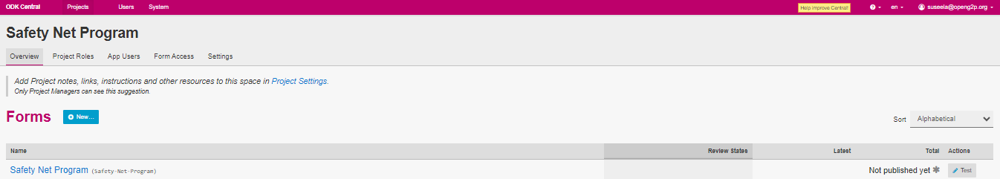

# Delete a Form

## Description

This document provides instructions to delete a form from a project using ODK Central.

## Prerequisites

* [ODK Central](https://docs.getodk.org/central-intro/) must be deployed and available
* A user must have valid credentials to login **ODK Central**
* A user must have an Administrator role in ODK Central. See [Create User and Assign Role](../../../pbms/features/administration/role-based-access-control/user-guides/assign-roles-to-users.md) guide

## Procedure

1. Login to the **ODK Central**
2. Click the relevant project link.

For example, here, the project is considered as Safety Net Program.

3. Click the project (Safety Net Program) link listed below the **Projects**.

<figure><figcaption>
ODK Central home screen
</figcaption></figure>

The project (Safety Net Program) overview page is displayed.

<figure><figcaption>
Safety Net Program
</figcaption></figure>

4. Click the Safety Net Program form available below the _**Forms**_.

For example, here the form selected is Safety Net Program Forms.

The  Safety Net Program form screen is displayed.

<figure><figcaption>
Safety Net Program
</figcaption></figure>

6. Click the _**Settings**_ tab.

You can find the _**Delete this Form**_ in the Draft section.

<figure><figcaption>
Safety Net Program - Delete Option
</figcaption></figure>

7. Click the _**Delete this form**_ button.

_**Delete Form**_ dialog box pops up.

<figure><figcaption>
Delete Form
</figcaption></figure>

8. Click the _**Yes, Proceed**_ button to delete the form.
9. Click the _**No, Cancel**_ button to retain the form.

This completes the deletion of a form.
