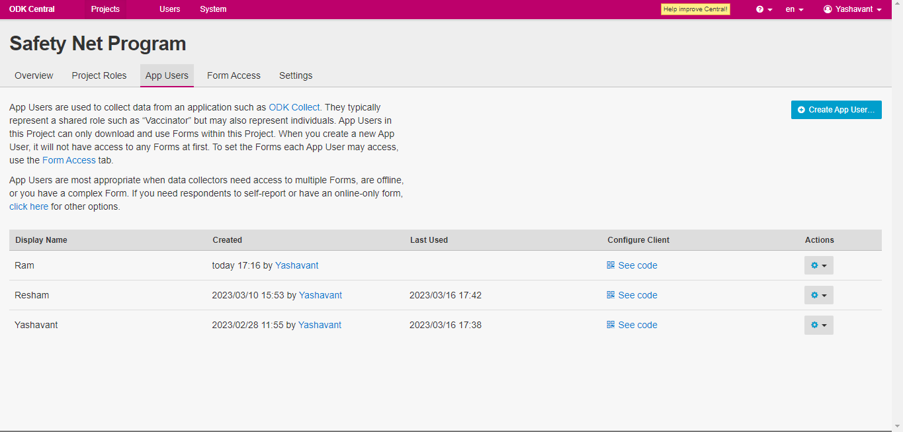
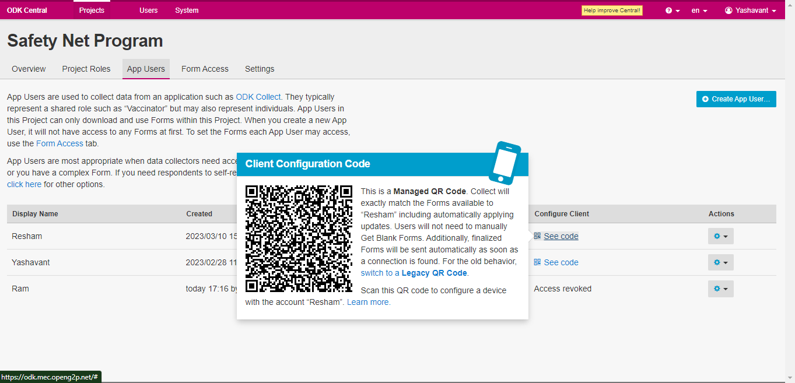
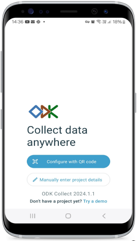
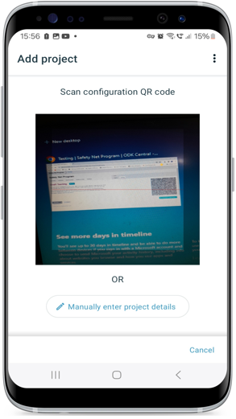
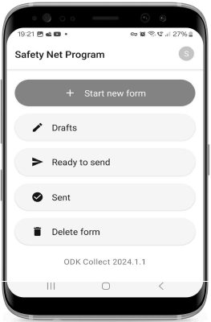

---
layout:
  title:
    visible: true
  description:
    visible: false
  tableOfContents:
    visible: true
  outline:
    visible: true
  pagination:
    visible: true
---

# Download Form on ODK Collect

## Description

This document provides instructions to download a program form on the ODK Collect App installed on an Android tablet or phone.

## Prerequisites

* The field agent must have ODK Collect App installed on his/her mobile device.
* The field agent must have[ form access](https://app.gitbook.com/s/xkdlCOLME2p03rS8nG8u/guides/user-guides/provide-form-access-to-field-agent).
* The user who helps the field agent to download a program form on his/her mobile device must have an Administrator role in ODK Central

## Procedure

1. &#x20;Login to the **ODK Central.**
2. &#x20;Click the relevant project link to upload a form.

For example, here, the project is considered as a Safety Net Program.

3. Click the project (Safety Net Program) link listed below the **Projects**.

<figure><figcaption></figcaption></figure>

The project (Safety Net Program) overview page is displayed.

<figure><figcaption>
Safety Net Program - Form
</figcaption></figure>

4. Click the _App Users_ tab.

The App Users screen is displayed.

<figure><figcaption></figcaption></figure>

5. Click the **See Code** link in _**Configure Client**_ column, the _**Client Configuration QR code**_ pops up.

<figure><figcaption></figcaption></figure>

6. Tap the ODK Collect App in the field agent device.

<figure><figcaption>
ODK  collect app
</figcaption></figure>

You can find the configuration modes.

<figure><figcaption>
Configure QR code
</figcaption></figure>

7. Tap the _**Configure with QR code**_ button.

Add project screen is displayed.

8. Scan the _**QR code**_ of a relevant program form from the ODK Central.

<figure><figcaption>
Scan QR code
</figcaption></figure>

The relevant program form is configured/downloaded in the agent's mobile device.

<figure><figcaption>
Downloaded form
</figcaption></figure>

This completes the process to download a form in ODK Collect App from ODK Central.
