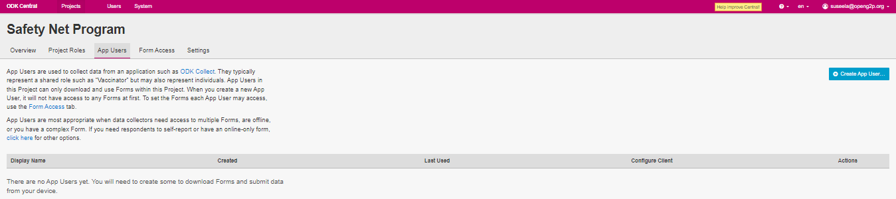
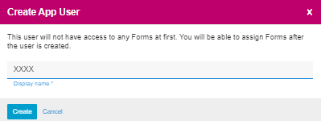
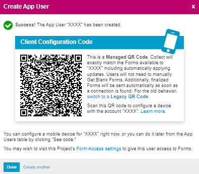
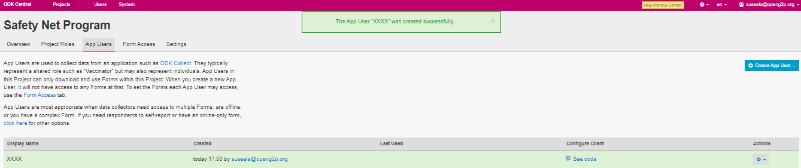

---
layout:
  title:
    visible: true
  description:
    visible: false
  tableOfContents:
    visible: true
  outline:
    visible: true
  pagination:
    visible: true
---

# 📔 Provide Form Access to Field Agent

## Description

This document guides to provide the form access to the field agent which helps them to download the program form from **ODK Central**.

## Prerequisites

The access provider must have Administrator role in **ODK Central**.

## Procedure

1. Login to **ODK Central**.
2. Click the relevant project link listed below the _**Projects**_ on which the access is to be provided to the agent.

For example, here, the project is considered as Safety Net Program

3. Click the project (Safety Net Program) link listed below the **Projects**.

<figure><figcaption>
ODK Central home screen
</figcaption></figure>

The project (Safety Net Program) overview page is displayed.

<figure><figcaption>
Safety Net Program
</figcaption></figure>

4. Click the **App Users** tab

The _**App Users**_ screen is displayed.

<figure><figcaption>
Safety Net Program - App User
</figcaption></figure>

5. Click the _**+Create App User**_ button to add a field agent to the program.

_**Create App User**_ screen pops up.

<figure><figcaption>
Create App User
</figcaption></figure>

6. Enter the name of the field agent on the popup window.
7. Click the **Create** button.

_**Create App User**_ screen with QR code is displayed. Read the instruction given in the Create App User screen.

8. Click the _**Done**_ button.

<figure><figcaption>
Successfully created App User
</figcaption></figure>

A message pops up on the successful creation of App user.

9. The agent name is listed in the App user list.

For example, here the app user is created as XXXX.

<figure><figcaption>
App User added
</figcaption></figure>

10. Click the _**Form Access**_ tab.

_**Form Access**_ screen is displayed.

11. Check the user against the form for which access is to be given for the user.
12. Click the _**Save**_ button.

A message pops up which confirms the form access to the selected user.

<figure><figcaption>
Safety Net Program - Form Access
</figcaption></figure>

This completes the process of providing form access to the field agent.
