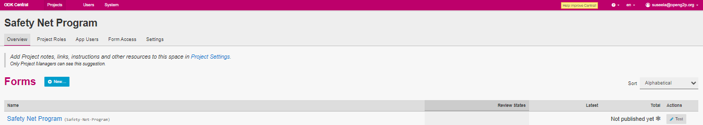
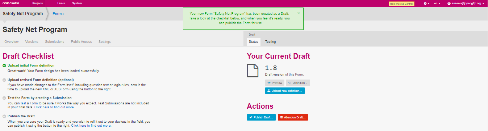
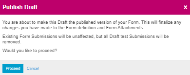
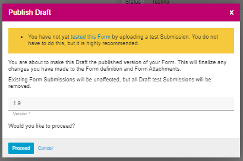
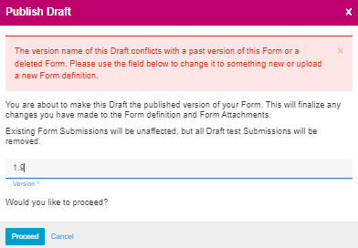
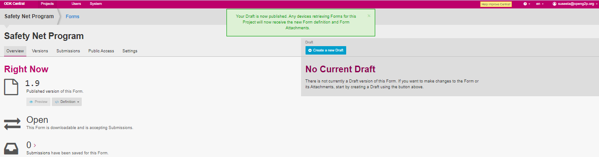
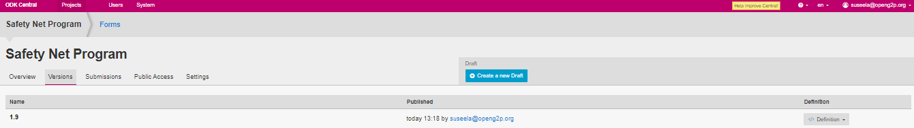

# Publish a Form

## Description

This document provides instructions to publish a form available in a project using ODK Central.

## Pre-requisites

* [ODK Central](https://docs.getodk.org/central-intro/) must be deployed and available
* The user must have valid credentials to login **ODK Central**
* The user must have an Administrator role in **ODK Central**. See [Create User and Assign Role](../../../pbms/features/administration/role-based-access-control/user-guides/assign-roles-to-users.md) guide.

## Procedure

1. Login to the **ODK Central**
2. Click the relevant project link.

For example, here, the project is considered as Safety Net Program.&#x20;

3. Click the project (Safety Net Program) link listed below the **Projects**.

<figure><figcaption></figcaption></figure>

4. The project (Safety Net Program) overview page is displayed.

<figure><figcaption>
Safety Net Program
</figcaption></figure>

&#x20;5\.  Click the form available below the _**Forms**_.

For example, here the form selected is Safety Net Program.

The  Safety Net Program Forms screen is displayed.

<figure><figcaption></figcaption></figure>

In the _**Draft**_ section, you can find two tabs.&#x20;

* Status
* Testing

**Status - Actions**

In the _**Status**_ tab, you can publish and delete form in _**Actions**_ section.

6. Click the _**Publish**_ button.

_**P**_**ublish Draft** screen pop-ups. Read the instruction and click the _**Proceed**_ button.

<figure><figcaption>
Publish Draft
</figcaption></figure>

Note:&#x20;

If you have not tested the form for submission before publishing, the below screen pops up. Take the required necessary action and click the _**Proceed**_ button.

<figure><figcaption>
Publish Draft 
</figcaption></figure>

7. Again _**Publish Draft**_ screen pops up. Read the instruction and change the version number of the form in the version field.
8. Click the _**Proceed**_ button.

<figure><figcaption>
Publish draft
</figcaption></figure>

9. A message pops up which provides the status of the form.
10. The updated draft version is now published.

<figure><figcaption>
Safety Net Program published
</figcaption></figure>

11. Click the _**Version**_ tab to find the published version of the form.

<figure><figcaption>
Safety Net Program - Version
</figcaption></figure>

This completes the process of publish a form in _**ODK Central**_.

