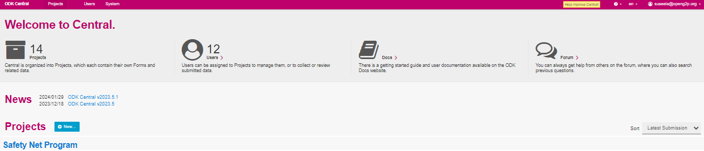
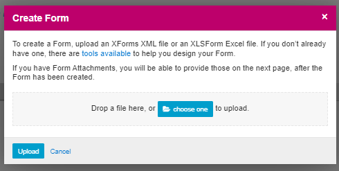

# Upload a Form

## Description

This document provides instructions to upload a form for a project in a program using ODK Central.

## Pre-requisites

* [ODK Central](https://docs.getodk.org/central-intro/) must be deployed and available
* The user must have valid credentials to login **ODK Central**
* The user must have an Administrator role in ODK Central. See [Create User and Assign Role](../../../pbms/features/administration/role-based-access-control/user-guides/assign-roles-to-users.md) guide.

## Procedure

1. Login to the **ODK Central**
2. Click the relevant project link to upload a form.

For example, here, the project is considered as Safety Net Program

3. Click the project (Safety Net Program) link listed below the **Projects**.

<figure><figcaption>
ODK Central home screen
</figcaption></figure>

4. The project (Safety Net Program) overview page is displayed.

<figure><figcaption>
Safety Net Program
</figcaption></figure>

5. In the Forms, click the _**+New..**_ button.
6. _**Create Form**_ screen pops up.

<figure><figcaption>
Create form
</figcaption></figure>

7. Navigate and choose a form file from the location where it is stored.&#x20;

<figure><figcaption>
Safety Net Program
</figcaption></figure>

Note:&#x20;

You must read the information and upload the type of file accepted as given in the _**Create Form**_ screen.

8. Click the _**Upload**_ button.&#x20;

A message pop ups on successful upload of the form. Once the form file is uploaded, the status of the form is in draft.

<figure><figcaption></figcaption></figure>

In the _**Draft Checklist**_ drop-down, by default, _**Upload initial Form definition**_ is selected.

Now the uploaded form is available in the relevant project screen.

<figure><figcaption>
Safety Net Program Form
</figcaption></figure>

This completes the upload of a form for a project in a program.
