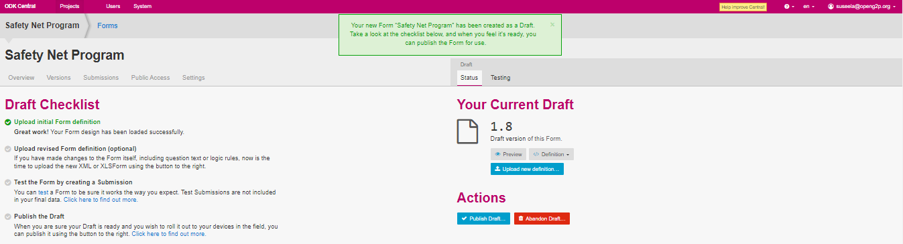

# Upload revised Form

## Description

This document provides instructions to upload a revised form available in a project using ODK Central.

## Pre-requisites

* [ODK Central](https://docs.getodk.org/central-intro/) must be deployed and available
* A user must have valid credentials to login **ODK Central**
* A user must have an Administrator role in ODK Central. See [Create User and Assign Role](../../../pbms/features/administration/role-based-access-control/user-guides/assign-roles-to-users.md) guide

## Procedure

1. Login to the **ODK Central**
2. Click the relevant project link.

For example, here, the project is considered as Safety Net Program.&#x20;

3. Click the project (Safety Net Program) link listed below the **Projects**.

<figure><figcaption>
ODK Central home screen
</figcaption></figure>

The project (Safety Net Program) overview page is displayed.

<figure><figcaption>
Safety Net Program Form
</figcaption></figure>

4. Click the form available below the _**Forms**_.

For example, here the form selected is Safety Net Program Forms.

The  Safety Net Program screen is displayed.

<figure><figcaption></figcaption></figure>

In the _**Draft**_ section, you can find two tabs.&#x20;

* Status
* Testing

**Status - Your Current Draft**

In the **Status** tab, _**Your Current Draft**_ section displays the version history of the uploaded form. &#x20;

| Button                | Description                                                                                                                                                                                       |
| --------------------- | ------------------------------------------------------------------------------------------------------------------------------------------------------------------------------------------------- |
| Preview               | 
Click the <em><strong>Preview</strong></em> button to view the uploaded form.

                 |
| Definition            | 
Select the appropriate option to view/download the file.

The valid values are :
<ul><li>View XML in browser</li><li>Download as X Form (.xml)</li><li>Download as XLSX Form</li></ul> |
| Upload new Definition | Click the _**Upload new Definition**_ button, to upload the updated version of the draft file. The updated draft file overwrites the already existing draft file.                                 |

6. Click the _**Definition**_ button.
7. Select the appropriate option to download the form.
8. Navigate to the downloaded file path.

You can open the downloaded file and do the required changes such as delete, add and modify the text in the form and save the form.&#x20;

9. Click the _**Upload new Definition**_ button to upload the updated version of the draft file.

A message pops up on successful upload on updated version of the draft file.

<figure><figcaption>
Revised form
</figcaption></figure>

This completes the process of uploading a revised form in a program.
