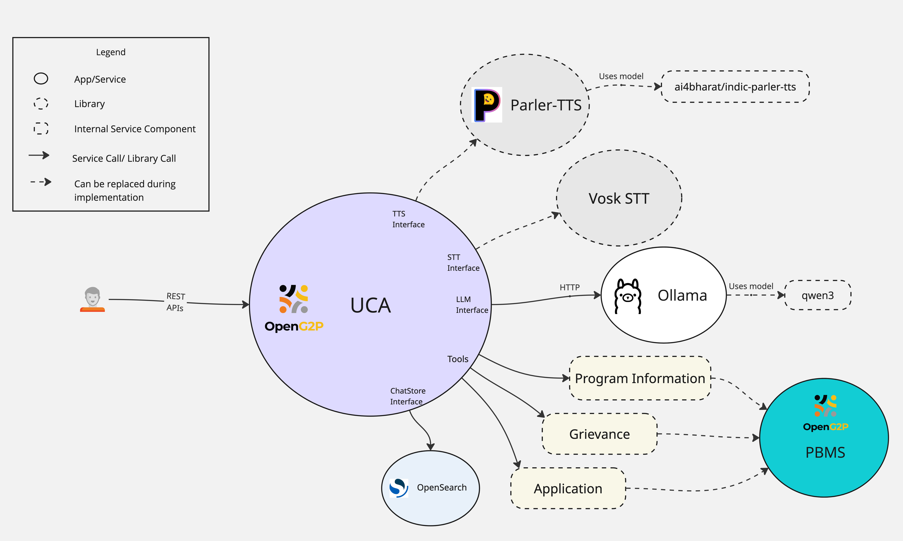
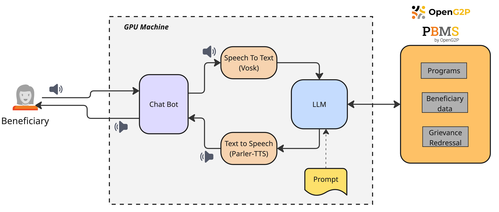

# Unified Conversation Agent (UCA)

This is an exploration project to build an AI-based Unified Conversation Agent (UCA) to make the lives of end users better and deliver useful services. UCA will leverage AI technologies to support OpenG2P use cases for social benefit delivery across programs and departments. This intelligent agent will engage directly with callers via voice, providing real-time updates on program statuses and disbursements, informing them about eligibility for additional programs, and enabling seamless program application entirely through phone or voice interactions.

## Features

* UCA responds to users' queries about information related to Programs.
  * Can determine programs that best suit the users based on their queries (or their data).
* UCA can determine whether users are eligible for specific programs based on the program's eligibility criteria.
* UCA helps users apply for programs after they have determined their necessary program (WIP).
* UCA responds to users' queries about grievances related to payments, etc.
* UCA can authenticate users via an OTP mechanism (where the user provides their ID, and UCA triggers an OTP) or any other decided authentication mechanism to verify that the user is the same person attempting to apply for a program or raise a grievance.
* Users can interact with UCA via real-time voice communication (RTC Calling) (WIP).
* Users can interact with UCA via a voice-enabled web-based chat interface. Users can send voice messages, and UCA can respond with voice messages. Currently, there are two chat modes (voice is included in both modes):
  * Regular chat mode, which requires users to be authenticated before they start chatting with UCA (same authentication mechanism as described above, but web-based).
    * Users' chats are persisted in the system, and users can refer back to their previous chats via the web interface in the form of chat threads.
    * When users start chatting, UCA already receives the authenticated user's data in order to help them determine their program eligibility or help with any other information.&#x20;
    * UCA doesn't perform any additional authentication when the user is applying for programs or raising grievances, as the user has already authenticated themselves before starting the chat. It may ask the user for any additional information that it doesn't already have.
  * Quick-chat mode, where any user (without authentication) can directly start chatting with UCA.
    * Users' chats are not persisted in the system. (Chats are cleared immediately after the user closes the web app.)
    * UCA may perform user authentication (using the auth mechanisms mentioned above) in the chat itself when a situation arises.
* UCA can connect to any backend system or database for program information, grievances, or program applications.

## Components & Design

<figure><figcaption></figcaption></figure>

#### Overview

* UCA backend contains a FastAPI-based API server that exposes chat, authentication, and other related APIs.
* Internally, the backend primarily interfaces with Ollama to generate AI responses. Moreover, it uses Ollama tool calling capabilities for retrieving information and allowing the AI to interact with external systems.

#### LLM Common (openg2p-llm-common) Python module

* This module contains classes and interfaces for different components required for a generic AI-based agent to function. The contents of this module are described as follows.
* Almost all the classes given here are defined as interfaces. This gives the system flexibility to have multiple implementations of the services, which can then be pieced together at runtime.
* "Tool" is a base class that exposes a "call\_tool" method.
  * These tools will be exposed to the LLM, and it can choose to call them when the situation arises.
  * Each Tool implementation should run a specific functionality when called. For example, ProgramInformationTool should retrieve the program information from the chosen backend. Or RaiseGrievanceTicketTool should raise a grievance ticket with the chosen backend.
  * Each Tool implementation has a request structure and a response structure, created using pydantic models. The LLM is informed about the request-response models of each Tool, so that it knows what parameters to pass when calling a Tool.
* "Agent" is a base class, which is defined as a combination of a set of Tools, a unique system prompt, and one Ollama model instance. One Tool may be part of multiple agents (it depends on the implementation of the wrapper holding the tools inside an Agent).
  * For example, an Agent called "ProgramInfoAgent" can contain tools related to Program Information, Beneficiary Information, Eligibility Information, etc. And an Agent called "GrievanceAgent" can contain tools related to Grievances, Beneficiary Information, etc.
  * Each Agent contains its own system prompt. A system prompt can be passed to the agent in the form of a text file (or a markdown file), so that the system prompt for each agent can be changed at runtime.&#x20;
  * The idea is to let the system contain multiple Agents, each catering to a particular functionality or need of the user.
  * The behaviour of each agent is different and may need a different LLM Model to work appropriately. Hence, each Agent is given the option to use a different Ollama instance that runs a particular model. Or they may all reuse the same instance if they are all using the same Ollama model.
* "ChatStore" is a base class that defines a set of APIs that should store or retrieve chats against a given message ID, thread ID, or user ID. By default, an OpenSearch-based ChatStore class is implemented, which interacts with OpenSearch to store and retrieve chats.
  * If the system is required to store the user chats elsewhere, this base class can be reimplemented.
* "STTService" is a base class that defines a set of APIs that should convert the user's audio into text and detect silence when prompted.
  * A [Vosk](https://github.com/alphacep/vosk-api)-based STTService is implemented, which can be installed as a Python module extra when installing the "openg2p-llm-common" module.
  * It is assumed that the audio processing (detecting the incoming audio and converting it to raw audio bytes, including decoding and resampling, etc) is handled within the STTService.
* "TTSService" is a base class that defines a set of APIs that should convert a given text into audio and detect silence when prompted.
  * A [Parler-TTS](https://github.com/huggingface/parler-tts)-based STTService is implemented, which can be installed as a Python module extra when installing the "openg2p-llm-common" module.
  * It is assumed that text processing (manipulating text to generate proper words for symbols and numbers, etc), audio processing (converting the raw audio bytes to a playable audio format, including encoding and resampling, etc) are handled within the TTSService.

#### UCA (openg2p-uca) Python module

* This contains a REST API layer (written in FastAPI), which exposes APIs for chatting (in regular mode and quick-chat mode), including APIs for sending and receiving voice messages. These are called by the frontend that runs on the web browser.
  * This chat API flow is like this: User calls the voice chat API, which sends audio to the backend. Audio is then converted to text by the STTService. The text is then processed by the LLM, along with previous messages in the chat thread (this involves invoking the required tools). The generated response is returned to the user as a text message. The user may then call the speak API to play this response text message as audio.
* This module also exposes WebRTC APIs that allow users to talk to AI in real-time using purely audio input-output. (WIP)
  * Internally, the mechanism is similar to chat flow, where the input audio is first converted to text by the STTService. The text is then processed by LLM (including invoking the required tools). The response is then converted to audio by the TTSService and returned to the user.
  * A couple of differences in this approach are:
    * The audio conversion and processing are handled by the RTC layer itself.
    * The call audio or text (also referred to as call context) is local to the call only. Meaning the audio (or text) of the call is cleared immediately after the call is disconnected. User's audio and AI's audio.
* The above LLM Common Python module is the base module for the following tools, agents, etc.
* This module implements some Tools (exact names of tools and the full list can be checked from the [source code](./#source-code)) like:
  * Perform Authentication
  * Program Information
  * Get Beneficiary Information: based on the user's ID after authentication
  * Raise Grievance Ticket
  * Get Grievance Ticket Status
* This module also implements one Agent that makes use of all the above tools. (WIP. This is done for the PoC, but may change during implementation.)

## Proof of concept Demo

### PoC setup

* The following components have been installed and set up on a machine in the IIITB Datacenter, which contains a CUDA-12.8 compatible NVIDIA GPU.
  * UCA Backend: contains chatbot (FastAPI-based) + STT engine (VOSK) + TTS engine (Parler-TTS). Other dependencies include:
    * The models for STT & TTS and the required Ollama models were downloaded.
    * OpenSearch for chat store.
    * Valkey for the session store.
  * UCA Frontend: UI for users to interact with the chatbot.
  * Ollama v0.8.0
  * PBMS + PostgreSQL: exposes program information, beneficiary data, and grievance redressal mechanisms.

<figure><figcaption></figcaption></figure>

### PoC demo videos


Program Information Enquiry Demo



Grievance Demo


## How to run

Refer to [Developer Notes](https://github.com/OpenG2P/openg2p-uca?tab=readme-ov-file#developer-notes).

## Source Code

* Backend [https://github.com/OpenG2P/openg2p-uca](https://github.com/OpenG2P/openg2p-uca)
  * Contains LLM Common Python module and UCA Python module.
* PoC UI [https://github.com/OpenG2P/openg2p-uca-ui](https://github.com/OpenG2P/openg2p-uca-ui)
