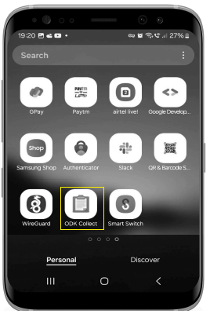
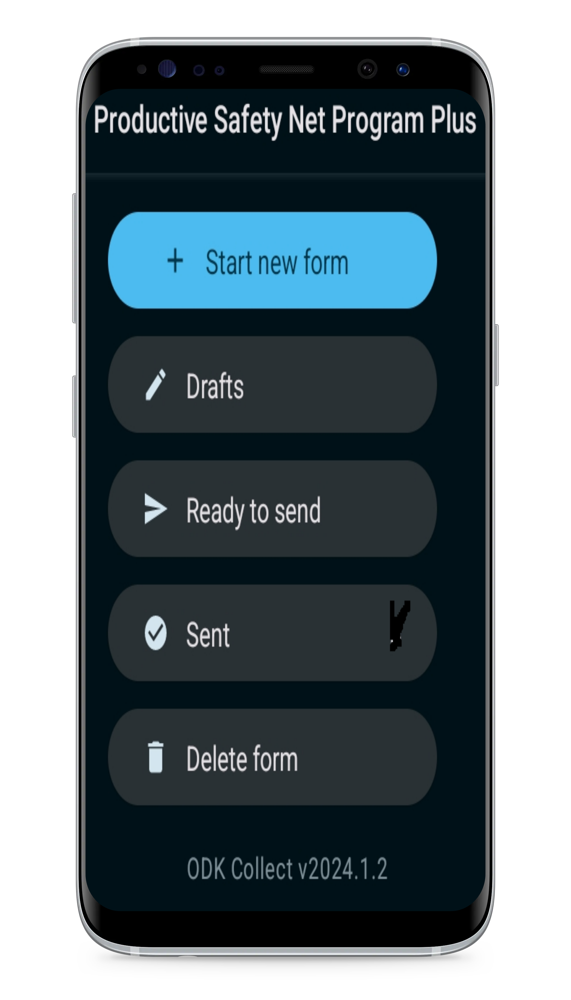
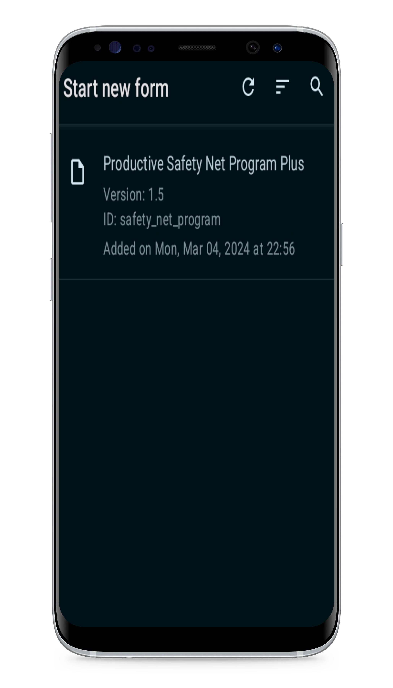
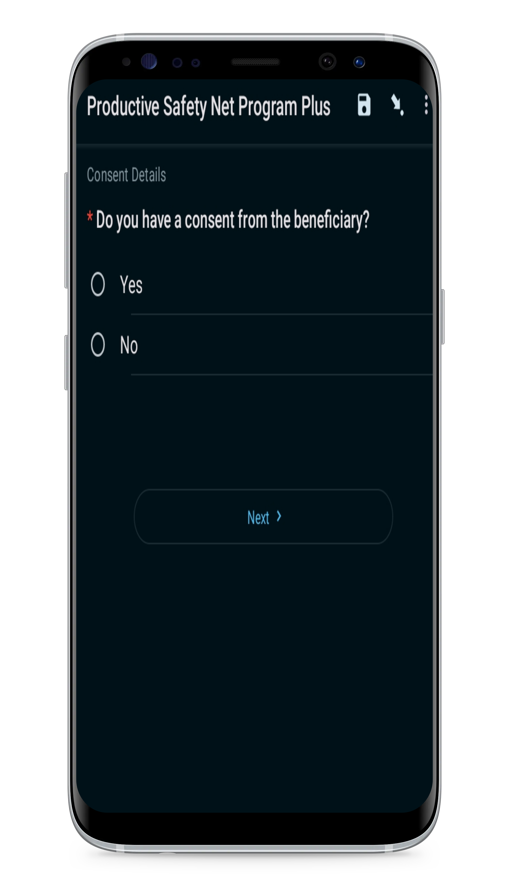
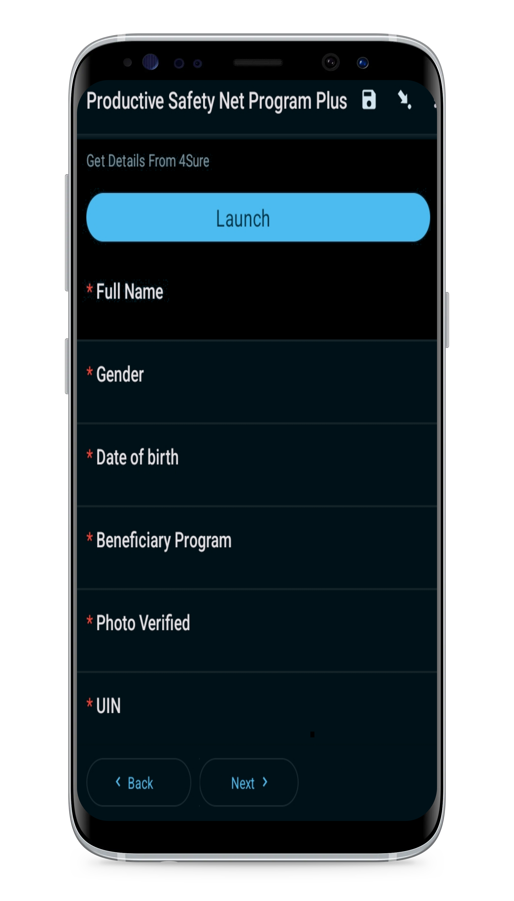
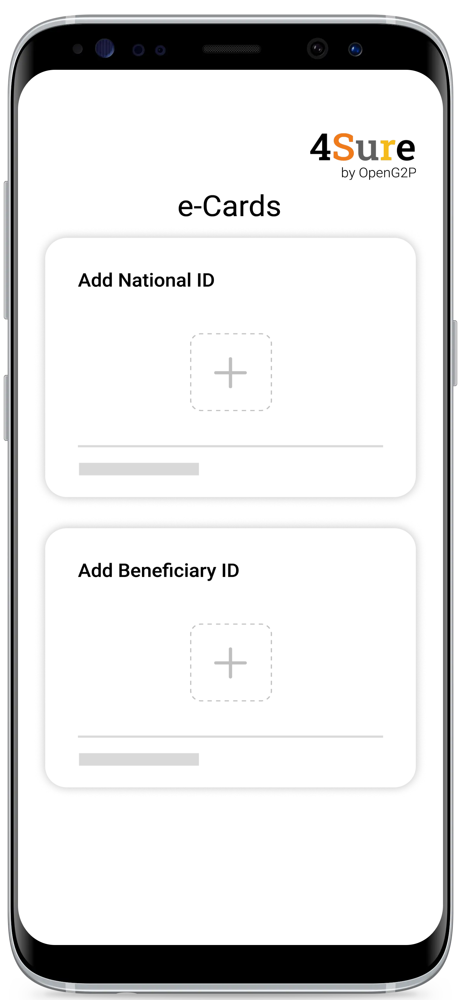
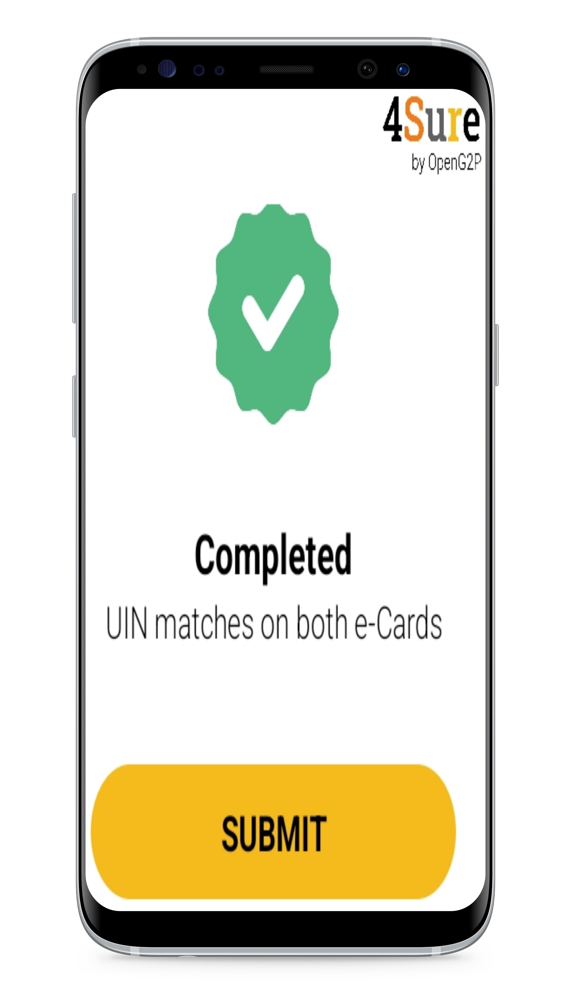
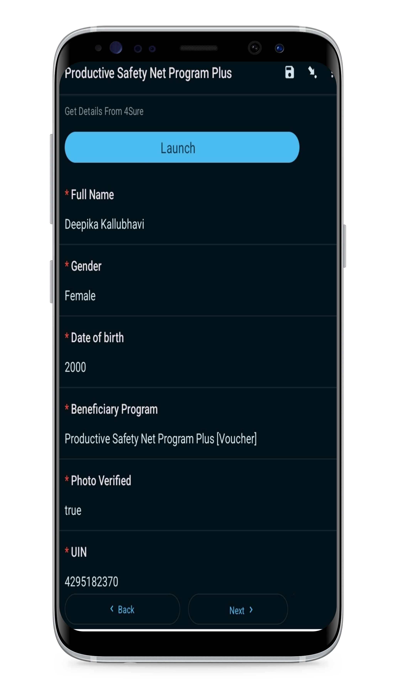

---
layout:
  title:
    visible: true
  description:
    visible: false
  tableOfContents:
    visible: true
  outline:
    visible: true
  pagination:
    visible: true
---

# Verify and Populate the form in ODK Collect using 4Sure Application

## Description

This document provides step-by-step instructions to launch 4Sure app in ODK Collect. The 4Sure app verifies the beneficiaries digital credentials and populate the data in the relevant program form in ODK Collect.

## Prerequisites

* A user must have installed _**4Sure**_ and _**ODK Collect**_ Apps in his/her mobile device
* A user must have installed _**Inji**_ in another mobile device. The Inji wallet must have the user's national ID and the beneficiary ID
* A user must have enabled _**Bluetooth**_ in both the mobile devices
* A user must have configured/downloaded the relevant program form in ODK Collect

## Procedure

1. Tap the _**ODK Collect**_ App.

<figure><figcaption>
ODK collect application
</figcaption></figure>

The configured/downloaded relevant program form is displayed.

For example, here the configured program form is Productive Safety Net Program.

2. Tap the _**Start New Form**_ button.

<figure><figcaption></figcaption></figure>

The program form history screen is displayed.

3. Tap the program form.

<figure><figcaption></figcaption></figure>

The Consent details screen is displayed.

<figure><figcaption></figcaption></figure>

4. Tap the appropriate option and click the _**Next**_ button.

Get details from 4Sure screen is displayed.

<figure><figcaption></figcaption></figure>

5. Tap the _**Launch**_ button.

The _**e-Cards**_ screen in 4Sure App is displayed.

<figure><figcaption></figcaption></figure>

6. Add the National ID and Beneficiary ID cards.&#x20;

You can follow the steps given in the [Verify Digital Credentials using 4Sure Application](https://app.gitbook.com/o/bnTr6Kp4z4CXR4QVIPSa/s/JZcdob2emEcLMvLyIxqT/\~/changes/79/utilities-and-tools/user-guides/verify-digital-credentials-using-4sure-application) user guide to add national ID and Beneficiary ID.

Once UIN matches on both the e-Cards, 4Sure App completes the verification process.

<figure><figcaption></figcaption></figure>

7. Tap the _**SUBMIT**_ button.

You can find the data which are available in the national ID and beneficiary ID are populated in the program form in the ODK Collect App.

<figure><figcaption></figcaption></figure>

8. Click the _**Next**_ button
9. Fill the remaining fields in the program form.

At the end of the program form he/she taps the _**Send**_ button to finish the registration process or taps the _**Save as draft**_ button to save the form.

When the field agent moves to the area with internet connectivity, the submitted entries will be sent to ODK Central and will be listed under _**View Sent Form**_ or the form will be saved in the field agents device in the _**Send Finalized** Form Section._
